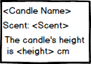

# Planning

[Back to Table of Contents](../../TABLE_OF_CONTENTS.md)
[Back to Components](../README.md)

## Mock Up

### Part of Pages:

* ["Candle List"](../../Pages/CandleList/README.md)

### Props (Estimated)

* name - a string for it's name

* scent - a string for it's scent

* height - a number representing it's height

### Contexts

* none

### Extra Info

* This will display a card for one candle.

[Back to Table of Contents](../../TABLE_OF_CONTENTS.md)
[Back to Components](../README.md)