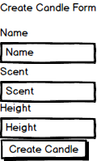

# Planning

[Back to Table of Contents](../../TABLE_OF_CONTENTS.md)
[Back to Components](../README.md)

## Mock Up

### Part of Pages:

* ["Create Candle"](../../Pages/CreateCandle/README.md)

### Props (Estimated)

* none

### Contexts

* Candle 
    * ADD_CANDLE (action) - when submit is clicked and successful we will run ADD_CANDLE function to add a candle to the list of candles.

[Back to Table of Contents](../../TABLE_OF_CONTENTS.md)
[Back to Components](../README.md)