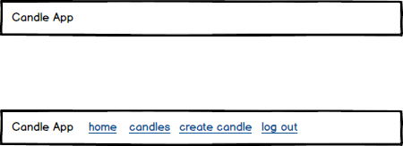

# Planning

[Back to Table of Contents](../../TABLE_OF_CONTENTS.md)
[Back to Components](../README.md)

## Mock Up

### Part of Pages:

* This is an App.js level component so it will show on all pages and not need to be pasted on each individual page

### Props (Estimated)

* none

### Contexts

* [User](../../Stores/User/README.md)
    * user (state) - it will not display menu options until user is done loading and will only display it if there is a logged in user after user data is done loading
    * SET_USER (action) - when logout is clicked we will run SET_USER function to clear out logged in user.

### Extra Info

* This component is utilized inside App.js instead of on each individual page

[Back to Table of Contents](../../TABLE_OF_CONTENTS.md)
[Back to Components](../README.md)