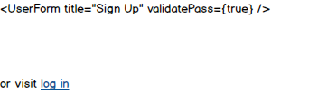

# Planning

[Back to Table of Contents](../../TABLE_OF_CONTENTS.md)
[Back to Components](../README.md)

## Mock Up

### Part of Pages:

* ["Sign Up"](../../Pages/SignUp/README.md)

### Props (Estimated)

* none

### Contexts

* none

### Extra Info

* This component will utilize the ["User Form"](../UserForm/README.md) component to display signup form

[Back to Table of Contents](../../TABLE_OF_CONTENTS.md)
[Back to Components](../README.md)