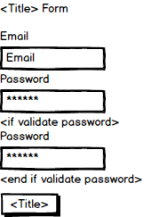

# Planning

[Back to Table of Contents](../../TABLE_OF_CONTENTS.md)
[Back to Components](../README.md)

## Mock Up

### Part of Pages:

* ["Sign Up"](../../Pages/SignUp/README.md)

* ["Login"](../../Pages/Login/README.md)

### Props (Estimated)

* title - a string to fill out the title above the form and the button below the form, e.g. "Log In"

* validPassword - a boolean which will determine whether or not to show the validate password field

* onSubmit - a function of what to do when submit is clicked

* disabled - a boolean which if true will disable the submit button (for after submit)

### Contexts

* none

### Extra Info

* This is written to have some shared functionality between login and signup forms.

[Back to Table of Contents](../../TABLE_OF_CONTENTS.md)
[Back to Components](../README.md)