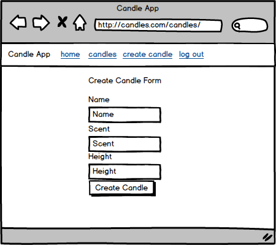

# Planning

[Back to Table of Contents](../../TABLE_OF_CONTENTS.md)
[Back to Pages](../README.md)

## Mock Up

### Components visible

* (App Level, not in this page directly)

    * [Nav Bar](../../Components/NavBar/README.md)

* Candle Create Page

    * [Candle Form](../../Components/CandleForm/README.md)

### Routes

* To Page: [GET - '/candles/create'](../../Routes/html/ROUTES.md)

* Retrieve User: [GET - '/api/user_data'](../../Routes/API/User/ROUTES.md)

### Contexts

* [User](../../Stores/User/README.md) 

    * refreshUser (hook) - when the component is loaded will refresh user to ensure user is logged in.

### User Story

* A user navigates to this page

* The page will retrieve user data to ensure the user is logged in

* if they are not logged in redirect them to the login page

* if they are logged in the user can now fill out the form for creating a new candle.

* when the user clicks submit the page will first ensure that all the inputs were filled out, then it will create a new candle for that user.

* if there is an error creating the candle, display the error to the user.

* if there is no error move them to the [Candle List Page](../CandleList/README.md)

[Back to Table of Contents](../../TABLE_OF_CONTENTS.md)
[Back to Pages](../README.md)