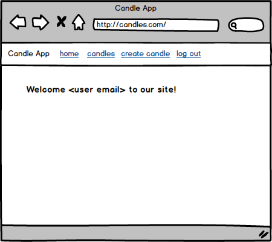

# Planning

[Back to Table of Contents](../../TABLE_OF_CONTENTS.md)
[Back to Pages](../README.md)

## Mock Up

### Components visible

* (App Level, not in this page directly)

    * [Nav Bar](../../Components/NavBar/README.md)

* User Page - Displays user info and welcome message.

### Routes

* To Page: [GET - '/'](../../Routes/html/ROUTES.md)

* Retrieve User: [GET - '/api/user_data'](../../Routes/API/User/ROUTES.md)

### Contexts

* [User](../../Stores/User/README.md)

    * refreshUser (hook) - when the component is loaded will refresh user to ensure user is logged in.

    * user (state) - we will display user info in welcome message.

### User Story

* A user navigates to this page

* The page will retrieve user data to ensure the user is logged in

* if they are not logged in redirect them to the login page

* if they are logged in simply display welcome message to the user.

[Back to Table of Contents](../../TABLE_OF_CONTENTS.md)
[Back to Pages](../README.md)