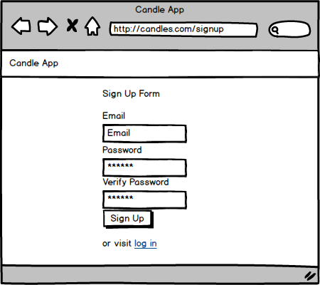

# Planning

[Back to Table of Contents](../../TABLE_OF_CONTENTS.md)
[Back to Pages](../README.md)

## Mock Up

### Components visible

* (App Level, not in this page directly)

    * [Nav Bar](../../Components/NavBar/README.md)

* Sign Up Page

    * [Sign Up Form](../../Components/SignUpForm/README.md)

        * [User Form](../../Components/UserForm/README.md)

### Routes

* To Page: [GET - '/signup'](../../Routes/html/ROUTES.md)

* Retrieve User: [GET - '/api/user_data'](../../Routes/API/User/ROUTES.md)

### Contexts

* [User](../../Stores/User/README.md)

    * refreshUser (hook) - when the component is loaded will refresh user to ensure user is not logged in.

### User Story

* A user navigates to this page

* At the bottom of the page they can navigate to [Login Page](../Login/README.md)

* The page will retrieve user data to ensure the user is not logged in

* if they are logged in redirect them to the home page

* if they are not logged in the user can now fill out the form for their new user information.

* when the user clicks sign up the page will first ensure that all the inputs were filled out, then it will verify passwords match, then it will send the new user info to the server.

* if there is an error creating the user, display the error to the user.

* automatically log in the user

* if there is no error move them to the [Index Page](../Index/README.md)

[Back to Table of Contents](../../TABLE_OF_CONTENTS.md)
[Back to Pages](../README.md)